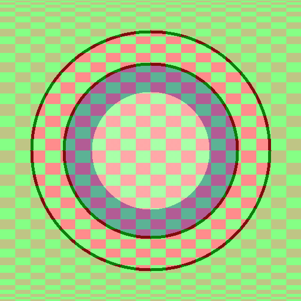
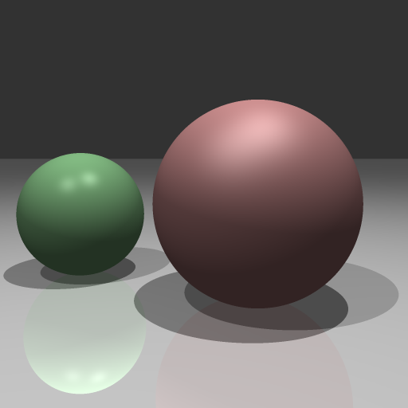

# Graphics-Things
Things I made during a graphics course

## P00_ImageFormation
Learning about image composition, gradients and whatnot.

## P02_Raytrace
A simple raytracer.

Implemented in python and JavaScript

